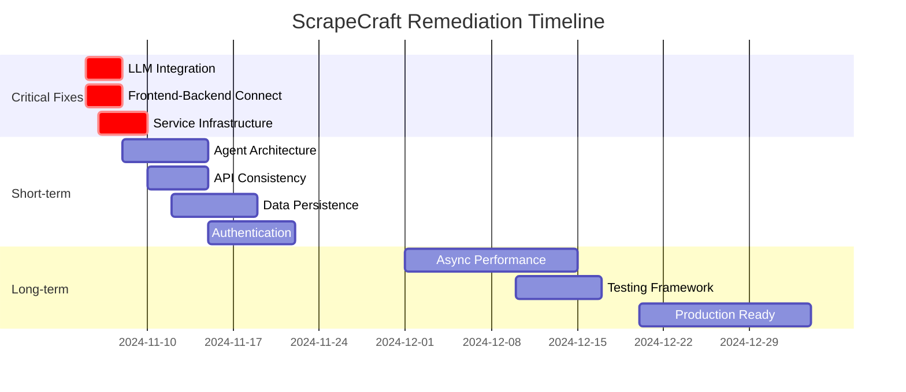

# ScrapeCraft OSINT Platform - Critical Remediation Plan

## Executive Summary

The ScrapeCraft OSINT platform is currently operating as a **sophisticated simulation** rather than a functional intelligence gathering tool. The Investigation Planner's preset messages are the visible symptom of systemic failures across the AI integration pipeline, service infrastructure, and architectural consistency.

This plan provides a structured approach to restore operational functionality and transform the platform into a production-ready OSINT system.

---

## 🎯 Root Cause Analysis

### Primary Issue: Cascading AI Integration Failure
1. **Frontend-Backend Disconnect**: Investigation Planner uses hardcoded `setTimeout()` responses
2. **LLM Integration Collapse**: Agents fall back to template responses when APIs fail
3. **Configuration Mismatch**: OpenRouter configuration vs OpenAI agent implementations, no support for custom AI endpoints
4. **Service Infrastructure Collapse**: Critical services (Redis, auth) disabled

### Secondary Issues: Architectural Technical Debt
1. **Competing Patterns**: Legacy vs Specialized agents vs Workflow Graph
2. **Data Flow Inconsistencies**: Chat interface for formal investigations
3. **Security Vulnerabilities**: No authentication, no input validation
4. **Performance Bottlenecks**: Synchronous blocking, no connection pooling

---

## 🚨 Immediate Critical Fixes (Week 1)

### Phase 1.1: Restore Core AI Functionality

#### ✅ Fix LLM Integration Pipeline
**File**: `backend/app/services/openrouter.py`, `backend/app/config.py`
```python
// Current Issue: OpenRouter config but agents expect OpenAI, no custom endpoint support
// Solution: Create flexible LLM provider system supporting OpenRouter, OpenAI, and custom endpoints
```

**Actions**:
1. Create flexible LLM provider system supporting multiple endpoints
2. Add support for custom OpenAI-compatible API endpoints and models
3. Fix environment variable validation for multiple LLM providers
4. Remove OpenAI fallback logic that masks integration failures
5. Add proper error handling and retry mechanisms for all providers

**New Configuration Options**:
```python
# Custom LLM Provider Configuration
CUSTOM_LLM_ENABLED: bool = False
CUSTOM_LLM_BASE_URL: str = "https://api.your-provider.com/v1"
CUSTOM_LLM_API_KEY: str = ""
CUSTOM_LLM_MODEL: str = "your-custom-model"
LLM_PROVIDER: str = "openrouter"  # Options: "openrouter", "openai", "custom"
```

#### ✅ Connect Frontend to Backend
**File**: `frontend/src/components/OSINT/Chat/InvestigationPlanner.tsx`

**Actions**:
1. Replace `setTimeout()` template responses (lines 57-74)
2. Integrate with `/api/ai-investigation/start` endpoint
3. Add real-time WebSocket updates for investigation progress
4. Implement proper loading states and error handling

#### ✅ Enable Service Infrastructure
**Files**: `backend/app/main.py`, `backend/app/services/task_storage.py`

**Actions**:
1. Re-enable Redis task storage (commented lines 38-42)
2. Restore authentication system (resolve cryptography dependencies)
3. Fix enhanced WebSocket connection manager
4. Add health checks for all critical services

---

## 🔧 Short-term Improvements (Month 1)

### Phase 2.1: Architecture Standardization

#### ✅ Consolidate Agent Architecture
**Decision**: Adopt Specialized Agents pattern, deprecate legacy agents

**Actions**:
1. Migrate functionality from `app/agents/legacy/` to `app/agents/specialized/`
2. Standardize agent interfaces and communication protocols
3. Remove duplicate agent implementations
4. Implement proper agent lifecycle management

#### ✅ API Consistency
**Files**: All `backend/app/api/*.py` files

**Actions**:
1. Standardize REST patterns across all endpoints
2. Consolidate `/api/ai-investigation` and `/api/osint` patterns
3. Implement consistent error response formats
4. Add comprehensive API documentation

#### ✅ Data Persistence Layer
**Files**: `backend/app/services/database.py`, migration files

**Actions**:
1. Replace in-memory dictionaries with proper database models
2. Implement investigation lifecycle persistence
3. Add data backup and recovery mechanisms
4. Create database migration scripts

### Phase 2.2: Security & Reliability

#### ✅ Authentication & Authorization
**Files**: `backend/app/api/auth.py`, `frontend/src/services/api.ts`

**Actions**:
1. Resolve cryptography dependency issues
2. Re-enable JWT-based authentication
3. Implement role-based access control for investigations
4. Add audit logging for sensitive operations

#### ✅ Error Handling & Monitoring
**Files**: All service files

**Actions**:
1. Replace silent failures with proper error propagation
2. Add comprehensive logging with structured formats
3. Implement health check endpoints
4. Add performance monitoring and alerting

---

## 📈 Long-term Strategic Improvements (Quarter 1)

### Phase 3.1: Performance & Scalability

#### ✅ Async Architecture
**Files**: All agent and service implementations

**Actions**:
1. Convert blocking operations to async/await patterns
2. Implement connection pooling for LLM APIs
3. Add caching layer for repeated requests
4. Optimize database queries and indexing

#### ✅ Testing Framework
**Files**: New test directories

**Actions**:
1. Create comprehensive integration test suite
2. Add end-to-end tests for critical user flows
3. Implement automated testing in CI/CD pipeline
4. Add performance and load testing

#### ✅ Production Readiness
**Files**: Docker configurations, deployment scripts

**Actions**:
1. Implement proper container orchestration
2. Add configuration management for environments
3. Implement secrets management
4. Add disaster recovery procedures

---

## 🛠️ Implementation Timeline



---

## 📊 Success Metrics

### Week 1 Targets (Critical)
- [ ] Investigation Planner shows real LLM responses
- [ ] No hardcoded template responses in production
- [ ] Flexible LLM provider system working (OpenRouter + custom endpoints)
- [ ] All services pass health checks
- [ ] Redis persistence enabled
- [ ] Frontend successfully connects to backend APIs
- [ ] Custom AI model integration tested and functional

### Month 1 Targets (Operational)
- [ ] Complete investigation workflow functional
- [ ] Authentication system re-enabled
- [ ] Data persists across service restarts
- [ ] No silent failures in logs
- [ ] API response times < 2 seconds

### Quarter 1 Targets (Production)
- [ ] Platform handles 100+ concurrent investigations
- [ ] 99.9% uptime with automated failover
- [ ] Complete test coverage (>80%)
- [ ] Security audit passed
- [ ] Production deployment ready
- [ ] Multi-provider LLM failover system implemented
- [ ] Custom model performance optimization completed

---

## 🔍 Risk Assessment & Mitigation

### High-Risk Items
1. **Data Loss During Migration**: Implement backup procedures before database changes
2. **API Key Exposure**: Use proper secrets management, never log credentials
3. **Service Downtime**: Use blue-green deployment for critical updates

### Medium-Risk Items
1. **Performance Regression**: Implement performance monitoring and rollback procedures
2. **Breaking Changes**: Version APIs and maintain backward compatibility
3. **User Experience Disruption**: Implement feature flags for gradual rollout

---

## 🚀 Quick Wins (Immediate Impact)

### 1. Fix Investigation Planner (1 day)
```typescript
// Replace setTimeout with actual API call
const response = await api.post('/ai-investigation/start', {
  target: input,
  objective: 'plan investigation',
  priority: 'medium'
});
```

### 2. Enable Redis Persistence (1 day)
```python
# Uncomment Redis initialization in main.py
await task_storage.connect()
logger.info("Redis task storage initialized")
```

### 3. Fix LLM Configuration (1 day)
```python
# Create flexible LLM provider system
def get_llm():
    if settings.LLM_PROVIDER == "custom":
        return ChatOpenAI(
            base_url=settings.CUSTOM_LLM_BASE_URL,
            api_key=settings.CUSTOM_LLM_API_KEY,
            model=settings.CUSTOM_LLM_MODEL,
            temperature=0.7,
            streaming=True
        )
    elif settings.LLM_PROVIDER == "openrouter":
        return ChatOpenAI(
            base_url="https://openrouter.ai/api/v1",
            api_key=settings.OPENROUTER_API_KEY,
            model=settings.OPENROUTER_MODEL,
            temperature=0.7,
            streaming=True,
            default_headers={
                "HTTP-Referer": "https://scrapecraft.app",
                "X-Title": "ScrapeCraft"
            }
        )
    # Fallback to OpenAI
    return ChatOpenAI(
        base_url=settings.OPENAI_BASE_URL,
        api_key=settings.OPENAI_API_KEY,
        model=settings.LLM_MODEL,
        temperature=0.7,
        streaming=True
    )
```

### 4. Custom AI Model Integration (2 days)
**File**: `backend/app/config.py`, `config/.env.example`

**Environment Configuration**:
```bash
# LLM Provider Selection
LLM_PROVIDER=custom  # Options: "openrouter", "openai", "custom"

# Custom LLM Provider Configuration
CUSTOM_LLM_ENABLED=true
CUSTOM_LLM_BASE_URL=http://localhost:11434/v1  # Ollama example
CUSTOM_LLM_API_KEY=your-api-key-here
CUSTOM_LLM_MODEL=llama3.2:instruct

# Alternative Custom Providers:
# LocalAI: http://localhost:8080/v1
# vLLM: http://localhost:8000/v1
# Custom Cloud: https://your-inference-api.com/v1
```

**Supported Custom Models**:
- **Ollama Models**: `llama3.2`, `codellama`, `mistral`, `qwen`
- **LocalAI Models**: Any GGUF or PyTorch model
- **vLLM Deployments**: High-performance inference
- **Custom Fine-tunes**: Your specialized OSINT models

---

## 📋 Implementation Checklist

### Pre-Implementation
- [ ] Backup current system state
- [ ] Create development branch
- [ ] Set up monitoring and alerting
- [ ] Prepare rollback procedures

### Week 1
- [ ] Fix LLM integration pipeline
- [ ] Connect frontend to backend
- [ ] Enable Redis and task storage
- [ ] Test core functionality end-to-end

### Month 1
- [ ] Consolidate agent architecture
- [ ] Implement authentication
- [ ] Add data persistence
- [ ] Create comprehensive tests

### Quarter 1
- [ ] Optimize performance
- [ ] Production deployment
- [ ] Security audit
- [ ] Documentation updates

---

## 🎯 Expected Outcomes

### Immediate (Week 1)
- **Investigation Planner** provides real AI-powered responses
- **Flexible LLM provider support** for OpenRouter, OpenAI, and custom endpoints
- **Data persistence** across service restarts
- **Proper error handling** with meaningful user feedback
- **Custom AI model integration** for self-hosted or specialized models

### Short-term (Month 1)
- **Complete investigation workflow** from planning to reporting
- **Secure access control** for sensitive investigations
- **Reliable service infrastructure** with monitoring

### Long-term (Quarter 1)
- **Production-ready OSINT platform** handling real investigations
- **Scalable architecture** supporting enterprise usage
- **Comprehensive testing** ensuring reliability

---

## 📞 Support & Resources

### Required Expertise
1. **Backend Developer**: Python/FastAPI, LLM integration, API design
2. **Frontend Developer**: React/TypeScript, WebSocket integration
3. **DevOps Engineer**: Docker, Redis, deployment automation, custom model hosting
4. **Security Specialist**: Authentication, audit, compliance
5. **AI/ML Engineer**: Custom model deployment, OpenAI-compatible API setup (optional)

### External Dependencies
1. **LLM Provider Services**: 
   - OpenRouter API (default)
   - OpenAI API (optional)
   - Custom OpenAI-compatible endpoints (self-hosted or third-party)
2. **Redis Cloud**: Production-grade caching and task storage
3. **Database Service**: PostgreSQL for persistent storage
4. **Monitoring Service**: Application and infrastructure monitoring

### Custom AI Model Setup
For custom OpenAI-compatible endpoints (e.g., Ollama, LocalAI, custom deployments):

```bash
# Environment Configuration
LLM_PROVIDER=custom
CUSTOM_LLM_BASE_URL=http://localhost:11434/v1  # Ollama example
CUSTOM_LLM_API_KEY=your-api-key
CUSTOM_LLM_MODEL=llama3.2:instruct
```

**Supported Custom Providers**:
- **Ollama**: Local models with `http://localhost:11434/v1`
- **LocalAI**: Self-hosted API with custom endpoint
- **vLLM**: High-performance inference servers
- **Custom OpenAI-compatible APIs**: Any provider following OpenAI API spec

---

This remediation plan transforms ScrapeCraft from a sophisticated demo into a fully functional OSINT platform. The phased approach ensures quick wins while building toward production readiness.

**Success**: When users can conduct real investigations with AI-powered planning using their preferred LLM provider (OpenRouter, OpenAI, or custom models), automated data collection, and comprehensive reporting - all backed by reliable, secure infrastructure.