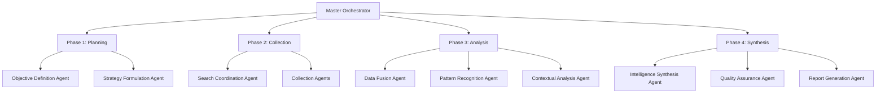

# AI Agent Architecture Design for Autonomous OSINT/SOCMINT

## 🏗️ System Architecture Overview

Based on the comprehensive research protocol, this document outlines the technical architecture for implementing autonomous AI agents for OSINT/SOCMINT operations using LangChain/LangGraph with CrewAI integration.

## 🧩 Core Architecture Components

### **1. Orchestration Layer (LangGraph)**



### **2. Agent Hierarchical Structure**

```python
# Agent Hierarchy
MasterOrchestrator
├── PlanningPhase
│   ├── ObjectiveDefinitionAgent
│   └── StrategyFormulationAgent
├── CollectionPhase
│   ├── SearchCoordinationAgent
│   ├── SurfaceWebAgent
│   ├── SocialMediaAgent
│   ├── PublicRecordsAgent
│   └── DarkWebAgent
├── AnalysisPhase
│   ├── DataFusionAgent
│   ├── PatternRecognitionAgent
│   └── ContextualAnalysisAgent
└── SynthesisPhase
    ├── IntelligenceSynthesisAgent
    ├── QualityAssuranceAgent
    └── ReportGenerationAgent
```

## 🔧 Technical Implementation Framework

### **Core Technology Stack**
- **Framework**: LangChain + LangGraph (Primary)
- **Multi-Agent**: CrewAI (For specialized crews)
- **Scraping**: ScrapeCraft + ScrapeGraphAI
- **Storage**: PostgreSQL + Redis
- **Memory**: LangChain Memory + Vector Database
- **Communication**: RabbitMQ/Redis Pub/Sub

### **Agent Base Class Architecture**

```python
from abc import ABC, abstractmethod
from typing import Dict, Any, List, Optional
from langchain.agents import AgentExecutor
from langchain.memory import ConversationBufferMemory
from langchain.tools import BaseTool

class OSINTAgent(ABC):
    """Base class for all OSINT agents"""
    
    def __init__(
        self,
        agent_id: str,
        role: str,
        tools: List[BaseTool],
        memory: Optional[ConversationBufferMemory] = None
    ):
        self.agent_id = agent_id
        self.role = role
        self.tools = tools
        self.memory = memory
        self.executor = AgentExecutor.from_agent_and_tools(
            agent=self._create_agent(),
            tools=self.tools,
            memory=self.memory,
            verbose=True
        )
    
    @abstractmethod
    def _create_agent(self):
        """Create the LangChain agent"""
        pass
    
    @abstractmethod
    def _get_system_prompt(self) -> str:
        """Get system prompt for this agent"""
        pass
    
    async def execute(self, input_data: Dict[str, Any]) -> Dict[str, Any]:
        """Execute agent task"""
        result = await self.executor.arun(input_data)
        return self._process_output(result)
    
    @abstractmethod
    def _process_output(self, raw_output: str) -> Dict[str, Any]:
        """Process and structure agent output"""
        pass
```

## 🎯 Specialized Agent Implementations

### **Phase 1 Agents**

#### **ObjectiveDefinitionAgent**
```python
class ObjectiveDefinitionAgent(OSINTAgent):
    """Clarifies and structures investigation objectives"""
    
    def _get_system_prompt(self) -> str:
        return """
        You are an Objective Definition Specialist for OSINT investigations.
        
        Your role is to:
        1. Parse and clarify user requirements
        2. Identify Key Intelligence Requirements (KIRs)
        3. Define investigation scope and constraints
        4. Establish success criteria
        5. Identify legal/ethical boundaries
        
        Output structured investigation plan with:
        - Primary objectives
        - Secondary objectives
        - Success metrics
        - Constraints and limitations
        - Ethical considerations
        """
    
    def _create_agent(self):
        # Implementation with OpenAI/Local LLM
        pass
    
    def _process_output(self, raw_output: str) -> Dict[str, Any]:
        return {
            "objectives": self._extract_objectives(raw_output),
            "scope": self._extract_scope(raw_output),
            "constraints": self._extract_constraints(raw_output),
            "success_criteria": self._extract_success_criteria(raw_output)
        }
```

#### **StrategyFormulationAgent**
```python
class StrategyFormulationAgent(OSINTAgent):
    """Develops investigation strategy and methodology"""
    
    def _get_system_prompt(self) -> str:
        return """
        You are an Investigation Strategy Specialist.
        
        Based on the defined objectives, create a comprehensive investigation strategy:
        
        1. Select appropriate investigation methodologies
        2. Identify primary and secondary data sources
        3. Plan agent specialization allocation
        4. Define coordination protocols
        5. Establish timeline and milestones
        
        Consider:
        - Information availability
        - Source reliability
        - Technical capabilities
        - Time constraints
        - Resource requirements
        """
```

### **Phase 2 Agents**

#### **SearchCoordinationAgent**
```python
class SearchCoordinationAgent(OSINTAgent):
    """Orchestrates parallel search operations"""
    
    def __init__(self, **kwargs):
        super().__init__(**kwargs)
        self.active_searches = {}
        self.search_results = {}
    
    async def execute_parallel_searches(self, objectives: Dict[str, Any]) -> Dict[str, Any]:
        """Coordinate multiple parallel search operations"""
        
        search_tasks = [
            self._launch_surface_web_search(objectives),
            self._launch_social_media_search(objectives),
            self._launch_public_records_search(objectives),
            self._launch_dark_web_search(objectives)
        ]
        
        results = await asyncio.gather(*search_tasks, return_exceptions=True)
        
        return self._consolidate_search_results(results)
    
    async def _launch_surface_web_search(self, objectives: Dict[str, Any]):
        """Launch surface web search operations"""
        # Delegate to SurfaceWebAgent
        pass
    
    async def _launch_social_media_search(self, objectives: Dict[str, Any]):
        """Launch social media search operations"""
        # Delegate to SocialMediaAgent
        pass
```

### **Phase 3 Agents**

#### **DataFusionAgent**
```python
class DataFusionAgent(OSINTAgent):
    """Fuses and correlates data from multiple sources"""
    
    def _get_system_prompt(self) -> str:
        return """
        You are a Data Fusion Specialist for OSINT investigations.
        
        Your task is to consolidate and correlate data from multiple sources:
        
        1. Entity resolution and deduplication
        2. Temporal sequence alignment
        3. Geospatial correlation
        4. Relationship mapping
        5. Confidence scoring
        
        Output structured data with:
        - Unified entity profiles
        - Relationship networks
        - Temporal timelines
        - Geospatial mappings
        - Confidence assessments
        """
    
    def _process_output(self, raw_output: str) -> Dict[str, Any]:
        return {
            "entities": self._extract_entities(raw_output),
            "relationships": self._extract_relationships(raw_output),
            "timeline": self._extract_timeline(raw_output),
            "geospatial": self._extract_geospatial(raw_output),
            "confidence_scores": self._extract_confidence(raw_output)
        }
```

## 🔄 LangGraph Workflow Implementation

### **State Management**
```python
from typing import TypedDict, List, Dict, Any
from langgraph.graph import StateGraph, END

class InvestigationState(TypedDict):
    """State for OSINT investigation workflow"""
    
    # Input
    user_request: str
    objectives: Dict[str, Any]
    
    # Phase 1: Planning
    investigation_plan: Dict[str, Any]
    strategy: Dict[str, Any]
    
    # Phase 2: Collection
    search_results: Dict[str, List[Dict[str, Any]]]
    raw_data: Dict[str, Any]
    
    # Phase 3: Analysis
    fused_data: Dict[str, Any]
    patterns: List[Dict[str, Any]]
    context_analysis: Dict[str, Any]
    
    # Phase 4: Synthesis
    intelligence: Dict[str, Any]
    quality_assessment: Dict[str, Any]
    final_report: Dict[str, Any]
    
    # Metadata
    timestamp: str
    confidence_level: float
    sources_used: List[str]
```

### **Workflow Graph Construction**
```python
def create_osint_workflow() -> StateGraph:
    """Create the main OSINT investigation workflow"""
    
    workflow = StateGraph(InvestigationState)
    
    # Add nodes for each phase
    workflow.add_node("define_objectives", objective_definition_node)
    workflow.add_node("formulate_strategy", strategy_formulation_node)
    workflow.add_node("coordinate_search", search_coordination_node)
    workflow.add_node("collect_data", data_collection_node)
    workflow.add_node("fuse_data", data_fusion_node)
    workflow.add_node("recognize_patterns", pattern_recognition_node)
    workflow.add_node("analyze_context", contextual_analysis_node)
    workflow.add_node("synthesize_intelligence", intelligence_synthesis_node)
    workflow.add_node("quality_assurance", quality_assurance_node)
    workflow.add_node("generate_report", report_generation_node)
    
    # Define workflow edges
    workflow.add_edge("define_objectives", "formulate_strategy")
    workflow.add_edge("formulate_strategy", "coordinate_search")
    workflow.add_edge("coordinate_search", "collect_data")
    workflow.add_edge("collect_data", "fuse_data")
    workflow.add_edge("fuse_data", "recognize_patterns")
    workflow.add_edge("recognize_patterns", "analyze_context")
    workflow.add_edge("analyze_context", "synthesize_intelligence")
    workflow.add_edge("synthesize_intelligence", "quality_assurance")
    workflow.add_edge("quality_assurance", "generate_report")
    workflow.add_edge("generate_report", END)
    
    # Set entry point
    workflow.set_entry_point("define_objectives")
    
    return workflow.compile()
```

## 🤝 CrewAI Integration for Specialized Teams

### **Specialized Crew Definitions**
```python
from crewai import Agent, Crew, Task

class OSINTCrews:
    """Specialized crews for different investigation types"""
    
    @staticmethod
    def create_corporate_espionage_crew() -> Crew:
        """Create specialized crew for corporate espionage investigations"""
        
        agents = [
            Agent(
                role='Corporate Intelligence Analyst',
                goal='Identify corporate espionage indicators and insider threats',
                backstory='Expert in corporate security and competitive intelligence',
                tools=[financial_analysis_tool, employee_monitoring_tool]
            ),
            Agent(
                role='Supply Chain Analyst',
                goal='Map supply chain vulnerabilities and third-party risks',
                backstory='Specialist in supply chain security and risk assessment',
                tools=[supplier_database_tool, risk_assessment_tool]
            ),
            Agent(
                role='Cyber Threat Analyst',
                goal='Detect cyber espionage activities and APT indicators',
                backstory='Expert in cybersecurity and threat intelligence',
                tools=[threat_intel_tool, malware_analysis_tool]
            )
        ]
        
        tasks = [
            Task(
                description='Analyze employee behavior for insider threat indicators',
                agent=agents[0],
                expected_output='Risk assessment report with identified threats'
            ),
            Task(
                description='Evaluate supply chain security posture',
                agent=agents[1],
                expected_output='Supply chain vulnerability map'
            ),
            Task(
                description='Identify cyber espionage activities',
                agent=agents[2],
                expected_output='Threat intelligence brief'
            )
        ]
        
        return Crew(
            agents=agents,
            tasks=tasks,
            verbose=True
        )
```

## 🗄️ Data Management Architecture

### **Multi-Modal Data Storage**
```python
class OSINTDataManager:
    """Manages data across different storage systems"""
    
    def __init__(self):
        self.postgres_db = PostgreSQLConnection()
        self.redis_cache = RedisConnection()
        self.vector_db = ChromaDB()  # For semantic search
        self.file_storage = S3Storage()
    
    async def store_raw_data(self, data: Dict[str, Any], metadata: Dict[str, Any]):
        """Store raw collected data"""
        # Store in PostgreSQL for structured queries
        await self.postgres_db.insert("raw_data", data, metadata)
        
        # Store in Redis for quick access
        await self.redis_cache.set(f"raw_data:{metadata['id']}", data)
        
        # Store embeddings in vector DB for semantic search
        if "text_content" in data:
            embedding = await self._generate_embedding(data["text_content"])
            await self.vector_db.add(
                ids=[metadata['id']],
                embeddings=[embedding],
                documents=[data["text_content"]],
                metadatas=[metadata]
            )
    
    async def query_similar_data(self, query: str, limit: int = 10):
        """Query for semantically similar data"""
        query_embedding = await self._generate_embedding(query)
        results = await self.vector_db.query(
            query_embeddings=[query_embedding],
            n_results=limit
        )
        return results
```

## 📊 Monitoring & Analytics

### **Performance Metrics Dashboard**
```python
class OSINTMetrics:
    """Track system performance and investigation metrics"""
    
    def __init__(self):
        self.metrics_collector = PrometheusCollector()
        self.logger = StructuredLogger()
    
    async def track_investigation_metrics(self, investigation_id: str, phase: str, metrics: Dict[str, Any]):
        """Track metrics for investigation phases"""
        
        await self.metrics_collector.increment(
            f"osint_investigation_{phase}_total",
            labels={"investigation_id": investigation_id}
        )
        
        await self.metrics_collector.histogram(
            f"osint_investigation_{phase}_duration",
            metrics["duration"],
            labels={"phase": phase}
        )
        
        await self.logger.info(
            "Investigation phase completed",
            investigation_id=investigation_id,
            phase=phase,
            metrics=metrics
        )
```

## 🔒 Security & Compliance

### **Ethical Guardrails**
```python
class OSINTComplianceManager:
    """Ensures compliance with legal and ethical requirements"""
    
    def __init__(self):
        self.compliance_rules = self._load_compliance_rules()
        self.audit_logger = AuditLogger()
    
    async def validate_request(self, request: Dict[str, Any]) -> Dict[str, Any]:
        """Validate investigation request for compliance"""
        
        validation_result = {
            "approved": False,
            "violations": [],
            "modifications": []
        }
        
        # Check for PII collection restrictions
        if self._contains_pii_request(request):
            validation_result["violations"].append("PII collection without proper authorization")
        
        # Check for jurisdictional compliance
        if not self._check_jurisdictional_compliance(request):
            validation_result["violations"].append("Jurisdictional compliance issues")
        
        # Check for terms of service compliance
        if not self._check_tos_compliance(request):
            validation_result["violations"].append("Terms of service violations")
        
        validation_result["approved"] = len(validation_result["violations"]) == 0
        
        await self.audit_logger.log_compliance_check(request, validation_result)
        
        return validation_result
```

This architecture provides a comprehensive foundation for building autonomous OSINT/SOCMINT systems that can handle complex investigations while maintaining ethical standards and operational efficiency.